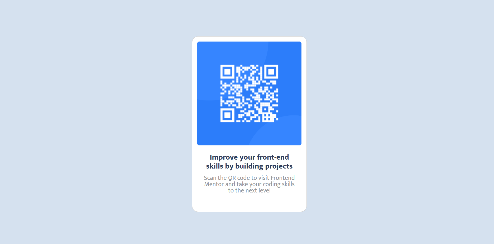

# Frontend Mentor - QR code component solution

This is a solution to the [QR code component challenge on Frontend Mentor](https://www.frontendmentor.io/challenges/qr-code-component-iux_sIO_H). Frontend Mentor challenges help you improve your coding skills by building realistic projects. 

## Table of contents

- [Overview](#overview)
  - [Screenshot](#screenshot)
  - [Links](#links)
- [My process](#my-process)
  - [Built with](#built-with)
  - [What I learned](#what-i-learned)
  - [Continued development](#continued-development)
  - [Useful resources](#useful-resources)
- [Author](#author)

## Overview

### Screenshot



### Links

- Solution URL: [Github Pages](https://darthskyy.github.io/Frontend-Mentor-Challenge---QR-Card/)

## My process

### Built with

- Semantic HTML5 markup
- CSS custom properties
- [Bootstrap](https://getbootstrap.com/docs/5.2/components/card/) - For the card style

### What I learned

Through this project I learnt more how to use the Card component of Bootstrap but I think I'm going to try to recreate a card element on my own. We'll see how it goes.

I'm quite proud of the fact that the card looks very close to the desired outcome given that I didn't get any specifications.

I also managed to estimate the size if the card well then use a media query to change the size of the card at mobile size
```css
.main-item {
    width: 288px;
    margin: 100px auto;
}

@media (max-width:700px) {
    .main-item {
        width: 67%;
    }
}
```

### Continued development

Next I'm going to try and recreate the page without using the Bootstrap card.

### Useful resources

- [Image Colour Picker](https://imagecolorpicker.com/en) - This helped me to get the colours from the preview image

## Author

- Github - [Simbarashe Mawere](https://github.com/darthskyy)
- Frontend Mentor - [@darthskyy](https://www.frontendmentor.io/profile/darthskyy)
- Linkedin - [Simbarashe Mawere](https://www.linkedin.com/in/simbarashe-mawere-465085143/)